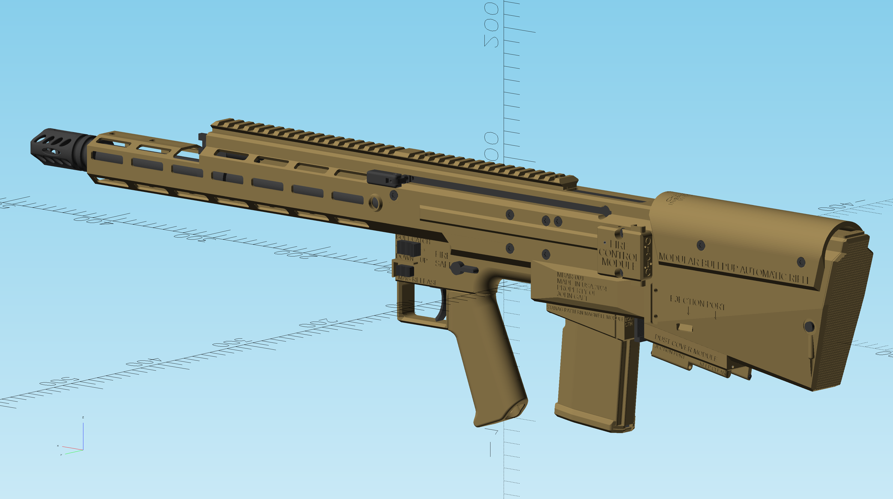
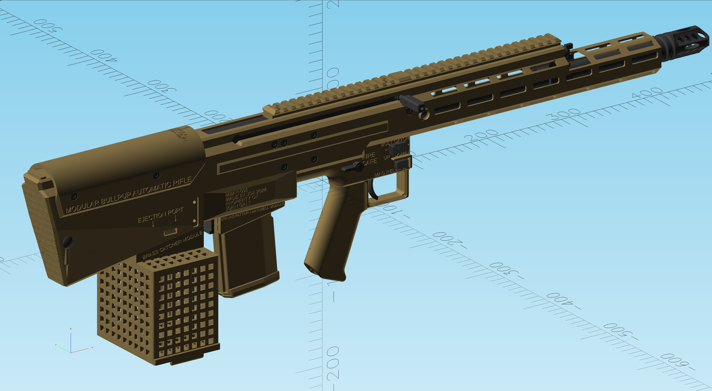
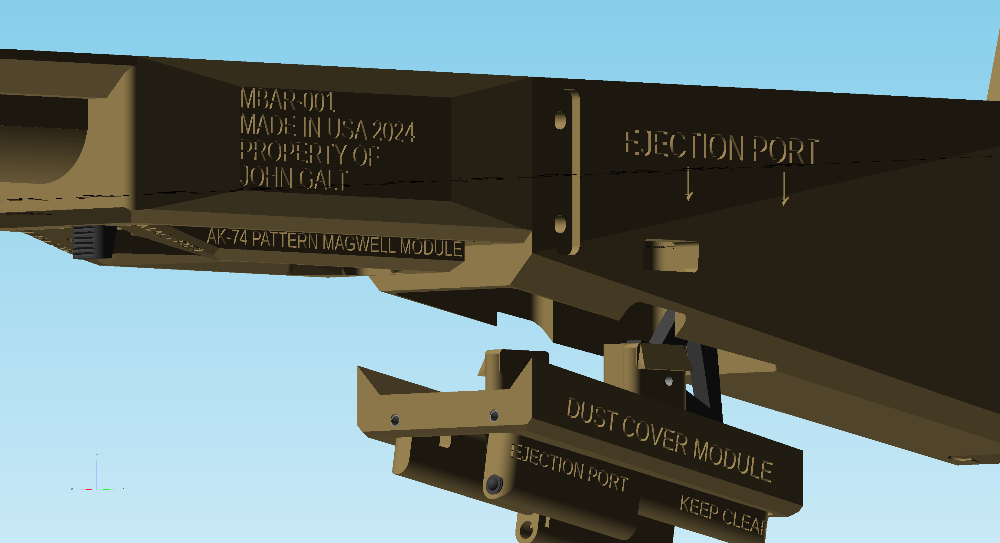

# Modular Bullpup Automatic Rifle (MBAR) NON-FUNCTIONAL VERSION

This repo is modified for use in video games, and does not contain any functional gemoetry. All part SCAD/STEP files have been removed. Therefore it is not controlled by ITAR/EAR. All fasteners, mounts, rails, bolt carrier firing pin, and fire control systems have all been removed. This lowers the polygon count for optimal game performance. Only the external geometry is 1:1 with the actual rifle.

I am giving permission for any game developer to use this in any game free of charge. I only ask that you do your best to depict the rifle accurately, and acknowledge me as the creator. Please contact me at johngalt@atlas-eng.net if you have any questions.

I would highly encourage watching the videos on my [Youtube channel](https://www.youtube.com/@johngalt4206) to learn how the rifle works. I've spent many hours documenting it as accurately as possible.

Specs of IRL rifle:

Basic empty weight: 6lbs (unloaded no optic laser flashlight or any other accessory)

Overall length: barrel length + 12in (mine has 18” barrel and 30” OAL)

Barrel length: mine has Faxon 18” heavy flute barrel with a rifle length system, but it can work for any length barrel

Length of pull: 13.5in (basically the same as an AUG)

Trigger Weight: varies based on the FCM used

Rate of fire: ~500 RPM

Cartridge:
* [any of these](https://en.wikipedia.org/wiki/List_of_AR_platform_cartridges#AR-15_cartridges) since rifle can accept any AR-15 bolt and barrel
* [any of these](https://en.wikipedia.org/wiki/List_of_AR_platform_cartridges#AR-10_cartridges) since rifle can accept any AR-10 bolt and barrel

Feed system:
* STANAG pattern box magazines
* SR-25 pattern box magazines
* [AKM/AK47 pattern magazines](https://www.youtube.com/watch?v=b_HmSsgaH1Y)
* AK74 pattern magazines
* SIX8/Magpul ICAR magazines

Ejection Port:

Ejection port is down, behind the magwell. This was done for true ambidextrous operation. There is an ejection port interface that allows the attachment of accessories. No accessory is required for operation.

Inspection port window:

The downward ejection port can no longer be used to clear jams or see if the weapon is loaded. This is a critical flaw in the Kel-Tec RDB. I fixed this by placing an opening on the top of the upper receiver. The non reciprocating charging handle acts as the “cover” for this opening, so it will only be exposed when the charging handle is pulled, and stay closed when the rifle is firing. This will also shield the operator from any gas blowback. The NRCH has a forward assist built into it.

Additional features:
* Same controls as AR-15, all controls are ambidextrous and symmetrical on both sides
* Backup mag release and bolt catch buttons are self contained in the magwell
* Barrel is free float
## Renders

### 5.56 NATO Build

### Sniper Variant with Brass Catcher

### Ejection Port

## Setup

You will want to install OpenSCAD (use nightly until there is a more recent release) to view the assembly.
This will show you how all the parts fit together. Open SCAD/assembly/complete.scad. Toggle the options to explode the model or change to a different cartridge.
If you need more detail open the any of the *.scad sub-assemblies in the folder.
